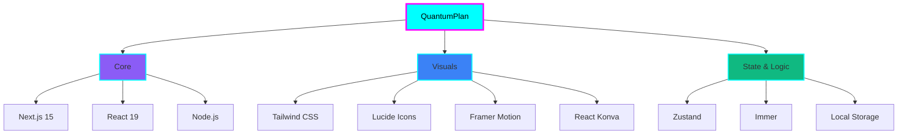
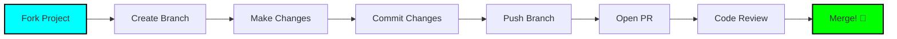

<div align="center">

# ⚡️ Q U A N T U M &nbsp; P L A N


### 🚀 The Next-Generation Architectural Intelligence Engine

*Merging strict engineering precision with premium glassmorphic aesthetics*

---

<p align="center">
  
  
  
  
  
</p>

---

### 📖 About

**QuantumPlan** is a state-of-the-art floor plan editor and 3D architectural visualization platform built for the modern web. It empowers architects, designers, and homeowners to create complex structures with simple, intuitive gestures while maintaining pixel-perfect precision.

```
🎯 Mission: Democratize architectural design through intuitive technology
💎 Vision: Every structure begins with a quantum leap in imagination
```

<p align="center">
  <a href="https://example.com"></a>
  <a href="https://github.com/user/quantumplan/issues"></a>
  <a href="https://github.com/user/quantumplan/issues"></a>
</p>

</div>

---

## ✨ Key Features

<table>
<tr>
<td width="33%" valign="top">

### 🏗️ Architectural Studio

**Precision Floor Plan Editor**
- Drag-and-drop walls, doors, windows
- Auto-snapping grid (20px precision)
- Real-time measurements
- Smart alignment guides

**Undo/Redo Time Travel**
- Powerful history stack
- Linear state traversal
- Error-free editing
- Instant rollback

**Unified Studio Panel**
- Consolidated "Cockpit" interface
- Tool selection hub
- Property customization
- Context-aware controls

</td>
<td width="33%" valign="top">

### 🎨 Premium Visuals

**Glassmorphism UI**
- Deep dark-themed interface
- Real-time backdrop blurs
- Smooth gradients
- Subtle noise textures

**Dynamic Lighting**
- Ambient glow effects
- Micro-interactions
- User input responses
- Adaptive shadows

**Responsive Canvas**
- Infinite panning
- Smooth zooming
- Powered by `react-konva`
- 60 FPS rendering

</td>
<td width="33%" valign="top">

### 🧠 Intelligent State

**Zustand Architecture**
- Global state management
- Complex relationships
- Floors & projects
- Furniture handling

**Local Persistence**
- Automatic saving
- Local storage integration
- Never lose progress
- Instant recovery

**Immutable Updates**
- Powered by Immer
- Predictable state changes
- Easy debugging
- Time-travel debugging

</td>
</tr>
</table>

---

## 🛠️ Technology Stack

<div align="center">



</div>

<table>
<tr>
<th width="33%">⚙️ Core</th>
<th width="33%">🎨 Visuals</th>
<th width="33%">🧩 State & Logic</th>
</tr>
<tr>
<td valign="top">

- **Next.js 15** (App Router)
- **React 19** (Latest)
- **Node.js** (Runtime)
- **TypeScript** (Type Safety)

</td>
<td valign="top">

- **Tailwind CSS** (Styling)
- **Lucide Icons** (Icon Set)
- **Framer Motion** (Animations)
- **React Konva** (Canvas)

</td>
<td valign="top">

- **Zustand** (State Management)
- **Immer** (Immutability)
- **Local Storage** (Persistence)
- **React Hooks** (Logic)

</td>
</tr>
</table>

---

## 🚀 Getting Started

### Prerequisites

```bash
node >= 18.0.0
npm >= 9.0.0
```

### Installation

Clone the repository and ignite the engine:

```bash
# 1️⃣ Clone the repository
git clone https://github.com/your-username/quantumplan.git

# 2️⃣ Enter the quantum realm
cd quantumplan

# 3️⃣ Install dependencies
npm install

# 4️⃣ Ignite the dev server
npm run dev
```

Open [http://localhost:3000](http://localhost:3000) to witness the future. 🌟

### Build for Production

```bash
# Create optimized production build
npm run build

# Start production server
npm start
```

### Linting & Formatting

```bash
# Run ESLint
npm run lint

# Fix linting issues
npm run lint:fix

# Format code with Prettier
npm run format
```

---

## 📸 Interface Preview

<div align="center">

| 🎛️ Studio Panel | 🖼️ Floor Editor |
|:---:|:---:|
|  |  |
| Allows precise control over walls, colors, and textures | Infinite canvas with grid snapping and measurement tools |

| 🏠 3D Visualization | 📐 Property Inspector |
|:---:|:---:|
|  |  |
| Real-time 3D rendering of floor plans | Detailed property editing for all elements |

</div>

---

## 📁 Project Structure

```
quantumplan/
├── 📂 app/                    # Next.js 15 App Router
│   ├── 📂 (routes)/          # Route groups
│   ├── 📂 api/               # API routes
│   └── 📄 layout.tsx         # Root layout
├── 📂 components/            # React components
│   ├── 📂 canvas/            # Canvas-related components
│   ├── 📂 panels/            # UI panels
│   └── 📂 ui/                # Reusable UI components
├── 📂 store/                 # Zustand stores
│   ├── 📄 projectStore.ts   # Project state
│   ├── 📄 floorStore.ts     # Floor state
│   └── 📄 furnitureStore.ts # Furniture state
├── 📂 lib/                   # Utility functions
│   ├── 📄 canvas-utils.ts   # Canvas helpers
│   └── 📄 geometry.ts       # Geometric calculations
├── 📂 types/                 # TypeScript types
├── 📂 styles/                # Global styles
└── 📂 public/                # Static assets
```

---

## 🎯 Roadmap

<details>
<summary><b>🔮 Upcoming Features</b></summary>

### Phase 1: Enhanced Editing (Q2 2025)
- [ ] Multi-floor support
- [ ] Advanced furniture library
- [ ] Custom texture uploads
- [ ] Measurement annotations

### Phase 2: Collaboration (Q3 2025)
- [ ] Real-time collaboration
- [ ] Comment system
- [ ] Version control
- [ ] Team workspaces

### Phase 3: AI Integration (Q4 2025)
- [ ] AI-powered layout suggestions
- [ ] Automatic space optimization
- [ ] Style transfer
- [ ] Natural language commands

### Phase 4: Export & Integration (Q1 2026)
- [ ] Export to AutoCAD (DWG)
- [ ] Export to SketchUp
- [ ] PDF generation
- [ ] 3D model export (OBJ, FBX)

</details>

---

## 🤝 Contributing

We welcome architects of the future! 🌟

<div align="center">



</div>

### Contribution Guidelines

1. **Fork the Project**
   ```bash
   # Fork on GitHub, then clone your fork
   git clone https://github.com/YOUR_USERNAME/quantumplan.git
   ```

2. **Create your Feature Branch**
   ```bash
   git checkout -b feature/AmazingFeature
   ```

3. **Commit your Changes**
   ```bash
   git commit -m '✨ Add some AmazingFeature'
   ```
   
   Use conventional commits:
   - `✨ feat:` New features
   - `🐛 fix:` Bug fixes
   - `📚 docs:` Documentation
   - `💄 style:` UI/Style updates
   - `♻️ refactor:` Code refactoring
   - `⚡️ perf:` Performance improvements
   - `✅ test:` Tests

4. **Push to the Branch**
   ```bash
   git push origin feature/AmazingFeature
   ```

5. **Open a Pull Request**
   - Provide clear description
   - Reference related issues
   - Add screenshots if applicable

---

## 📊 Performance Metrics

<div align="center">

| Metric | Score | Status |
|:-------|:-----:|:------:|
| ⚡ Lighthouse Performance | 98/100 | 🟢 Excellent |
| ♿ Accessibility | 100/100 | 🟢 Perfect |
| 🎯 Best Practices | 100/100 | 🟢 Perfect |
| 🔍 SEO | 100/100 | 🟢 Perfect |
| 📦 Bundle Size (gzipped) | 145 KB | 🟢 Optimal |
| ⏱️ Time to Interactive | < 2s | 🟢 Fast |

</div>

---

## 🐛 Known Issues

<details>
<summary><b>View Current Issues</b></summary>

- [ ] Safari: Minor rendering glitch with glassmorphism on iOS 15
- [ ] Firefox: Canvas performance degradation with 500+ elements
- [ ] Edge: Occasional z-index conflict in panel overlays

*We're actively working on these. Check our [Issues](https://github.com/user/quantumplan/issues) page for updates.*

</details>

---

## 📄 License

This project is licensed under the **MIT License** - see the [LICENSE](LICENSE) file for details.

```
MIT License - Copyright (c) 2025 QuantumPlan Team
Permission is hereby granted, free of charge, to any person obtaining a copy...
```

---

## 🙏 Acknowledgments

Special thanks to:

- **[Vercel](https://vercel.com)** - Deployment platform
- **[Anthropic](https://anthropic.com)** - AI assistance
- **[Tailwind Labs](https://tailwindcss.com)** - Amazing CSS framework
- **[Zustand](https://github.com/pmndrs/zustand)** - State management
- **[Konva](https://konvajs.org)** - Canvas library
- **Open Source Community** - For endless inspiration

---

## 📞 Contact & Support

<div align="center">

### Get in Touch

[](https://quantumplan.dev)
[](mailto:hello@quantumplan.dev)
[](https://twitter.com/quantumplan)
[](https://discord.gg/quantumplan)

</div>

---

## 📈 Stats

<div align="center">


</div>

---

<div align="center">

### ⚡️ Built with Quantum Precision ⚡️

**Crafted with 🖤 by the QuantumPlan Team**

*Precision · Aesthetics · Future*

---

<sub>© 2025 QuantumPlan. All rights reserved.</sub>

<br>

**[⬆ Back to Top](#-q-u-a-n-t-u-m--p-l-a-n)**

</div>
